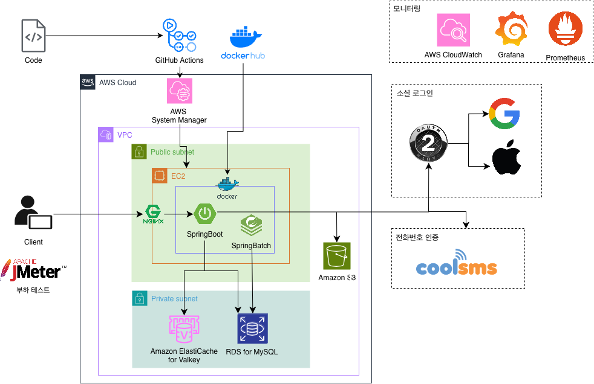

# Project COGO ☕️
본 프로젝트는 숭실대 Pre-스타트업 팀에 선정되어 교내 지원을 받고 있습니다.
# 프로젝트 설명 📄
IT 관련 고민을 가지고 있는 멘티들이 자대에 재학중인 멘토들에게 커피챗을 신청할 수 있는 플랫폼입니다.
# 서버 아키텍처

# 팀원 소개 👥

## 팀장 
| 
유예지
 | 
| :--------------------------- |
| **담당기능** 1. Project Lead 2. Back-end 구현 | 
|  |
| 
<a href="https://github.com/YEJIRYOO">YEJIRYOO</a>
 |

## Mobile
| 
지선의
 |
| :----------------------------- |
| **담당기능** 1. Mobile 구현 |
|  |
| 
<a href="https://github.com/sunnny619">sunnny619</a>
 |

## Back-end
| 
유예지
 |
| :----------------------------- |
| **담당기능** 1. Back-end 구현 |
|  |
| 
<a href="https://github.com/YEJIRYOO">YEJIRYOO</a>
 |

## Hall of Fame 👑

👑

| 
김교휘
 | 
강해솔
 | 
유진
 |
| :----------------------------- | :----------------------------- | :----------------------------- |
| **담당기능** 기존 팀장 / BE | **담당기능** 기존 Front-end | **담당기능** 기존 Mobile |
|  |  |  |
| 
<a href="https://github.com/KimKyoHwee">KimKyoHwee</a>
 | 
<a href="https://github.com/haesol822">haesol822</a>
 | 
<a href="https://github.com/HI-JIN2">HI-JIN2</a>
 |

| 
김동현
 | 
권정태
 | 
김지은
 |
| :----------------------------- | :----------------------------- | :----------------------------- |
| **담당기능** 기존 Back-end | **담당기능** 기존 Back-end | **담당기능** Project Manager |
|  |  |  |
| 
<a href="https://github.com/bricksky">bricksky</a>
 | 
<a href="https://github.com/oxdjww">oxdjww</a>
 | 
<a href="https://github.com/0zlrlo">0zlrlo</a>
 |

| 
최서현
 | 
최상원
 | |
| :----------------------------- | :----------------------------- | :--- |
| **담당기능** 1차 스프린트 FE | **담당기능** 1차 스프린트 FE | |
|  |  | |
| 
<a href="https://github.com/candosh">candosh</a>
 | 
<a href="https://github.com/ChoiSangwon">ChoiSangwon</a>
 | 

# 유저 플로우

